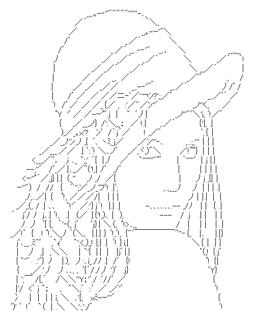

Differentiable Ascii Art Renderer
========

# Overview

Differential ascii art renderer that enables unsupervised learning of image-to-ascii-art conversion.

The renderer is easily combined with typical 2D CNN models, implemented in layers.py .

# Sample Result

|  |  |
|--|--|
|  |  |

more samples in generated_images directory.

# Usage example

```
python3 predict.py weights.h5 line_drawing_dir/*.png
```

* press 'w' key on window to write out the ascii art.

# Requirements

predict:

* tensorflow>=2.2.0
* opencv-python>=4.0.0
* numpy

train/experiment:

* tqdm
* opencv-contrib-python>=4.0.0
* pandas
* scikit-image
* fusewarp(https://github.com/stnk20/fusewarp)
